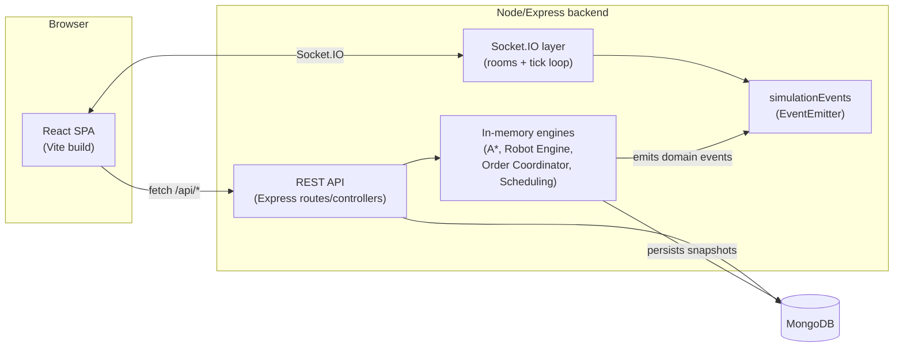
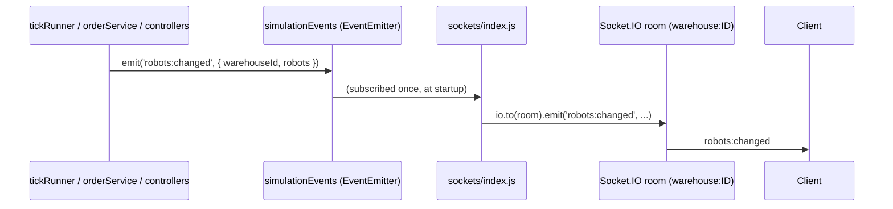

# Architecture

## System overview

Two ways in, one shared core. REST handles CRUD and one-off actions
(create a warehouse, spawn a robot, run a single A* query). Socket.IO
handles everything that happens *continuously* while a simulation is
running. Both go through the same in-memory engines - there's exactly one
implementation of "what a tick does," "how A* searches," and "how a robot
picks its next task," not two versions that could drift apart.

## Component responsibilities

| Layer | Where | Responsibility |
|---|---|---|
| Frontend state | `frontend/src/state/` | React hooks owning grid editing, live simulation state, AI visualisation, keyboard shortcuts - one hook per concern, each documented with why it's shaped the way it is |
| Frontend rendering | `frontend/src/components/simulation/GridCanvas.jsx` | Single `<canvas>`, viewport-culled, `requestAnimationFrame`-batched - see the Milestone 14 review in the [development log](./DEVELOPMENT_LOG.md) for why this was left alone rather than "optimized" without evidence |
| REST layer | `backend/src/routes/`, `controllers/` | Request validation (`express-validator`), thin controllers that call services/engines and format the response envelope |
| Real-time layer | `backend/src/sockets/` | Room membership, the server-owned per-warehouse tick loop (`tickLoopManager.js`), forwarding `simulationEvents` to the right room |
| Event bus | `backend/src/events/simulationEvents.js` | A plain `EventEmitter` decoupling the engines from Socket.IO - see [Real-time layer](#real-time-layer) below |
| Services | `backend/src/services/` | Bridge the pure, Mongo-agnostic engines to MongoDB: `simulationManager` (engine instance cache), `orderService` (order lifecycle + persistence), `tickRunner` (one tick, shared by the REST endpoint and the automatic loop) |
| Engines | `backend/src/engine/` | Pure, synchronous, no I/O: grid, A* pathfinding, robot state machine, order coordination, scheduling strategies, dynamic obstacles. Every one of these is unit-tested in isolation and reusable outside a request/tick context - see `backend/scripts/benchmark.js`, which drives them directly with no MongoDB or HTTP involved at all |
| Persistence | `backend/src/models/` | Mongoose schemas - see [`ER_DIAGRAM.md`](./ER_DIAGRAM.md) |

## The tick loop

A "tick" is one simulation step: move every robot, process any
pickup/delivery transitions that just happened, dispatch newly-idle
robots onto pending orders. `tickRunner.runTick(warehouseId, deltaSeconds)`
is the single implementation of this, called from two places:

- **`POST /warehouses/:id/tick`** - one manual step, useful for scripting
  or testing without a socket connection.
- **The server-owned tick loop** (`sockets/tickLoopManager.js`) - one
  `setInterval` per warehouse, shared by every client watching it, started
  by a `simulation:start` Socket.IO event and stopped either explicitly
  or automatically once nobody's left watching. This replaced an earlier,
  client-driven design (each browser tab running its own timer and
  calling the REST endpoint repeatedly) - see the Milestone 11 entry in
  the [development log](./DEVELOPMENT_LOG.md) for the full reasoning. The
  practical effect: the simulation keeps running for every other viewer
  even if whoever clicked "Start" closes their tab.

Every changed robot snapshot from a tick is persisted in one
`Robot.bulkWrite` call rather than one write per robot (Milestone 14) -
see [`backend/scripts/benchmark.js`](../backend/scripts/benchmark.js) for
measured throughput at the target scale of 50 simultaneous robots.

## Real-time layer

`simulationEvents` is a plain Node `EventEmitter` that every engine-facing
module (`tickRunner`, `orderService`, the warehouse/robot controllers)
emits into. `sockets/index.js` is the *only* thing that listens,
translating each event into a broadcast to the matching warehouse's room.
This indirection is why the 265 backend tests never need to know
Socket.IO exists: they mock the services directly and never load the
sockets module, so emitting into an unlistened bus is a no-op. See the
event catalogue in [`API.md`](./API.md#socketio-events).

## Pathfinding

`astarSteps` (a generator) is the one A* implementation, used two ways:

- **`findPath`** drains it for just the final result - what the Robot
  Engine calls on every tick for every robot that's moving or being
  replanned. As of Milestone 14 this passes `emitSteps: false`, so the
  whole search runs inside a single generator resumption with no
  per-node snapshot built at all (a 54.8x speedup on a search exploring
  ~1,800 nodes - see the development log).
- **`findPathWithTrace`** drains it while collecting every yielded
  snapshot (`trace: true`, `emitSteps` left at its default), capped at
  400 recorded frames regardless of how long the search actually runs.
  This is what powers the AI Visualisation Panel's step-by-step scrubber.

Both paths share the same search - there's no risk of the "fast" and
"visualized" versions of A* disagreeing, because they're the same code
with different amounts of bookkeeping attached.

## Frontend state shape

One hook per concern, each independently documented in its own file:

- `useSimulationGrid.js` - the grid itself, the active editing tool,
  saved-layout management (Milestone 13), backend sync
- `useLiveSimulation.js` - Socket.IO-driven robots/orders/obstacles/
  notifications for whichever warehouse is currently synced
- `usePathVisualization.js` - the AI Visualisation Panel's pick-mode,
  traced-search request, and step playback
- `useKeyboardShortcuts.js` - global shortcuts, careful to avoid
  colliding with the canvas's own key handling (see the Milestone 14 bug
  fix in the development log)

`GridCanvas.jsx` is the single rendering surface all of these feed into -
grid cells, robots, dynamic obstacles, the A* search overlay, and the
heatmap are drawn in that order, each gated behind its own prop so any
combination can be shown or hidden independently.

## Known limitations

Documented here rather than silently left for someone to discover:

- **A robot spawned via `POST /robots` doesn't retroactively join an
  already-cached live engine.** `simulationManager.getEngine` only seeds
  a warehouse's in-memory robot list from MongoDB on a cache miss (first
  access after a server restart, or after the warehouse's layout
  changes). A robot created after that point exists in the database and
  shows up in every connected client's roster (the `robots:changed`
  event still fires), but won't actually move until the engine cache is
  next rebuilt. Flagged in Milestone 11, not fixed since the fix would
  require touching `robot.controller.js`'s `create` handler in a way
  that risked hanging the existing test suite (see that milestone's entry
  in the development log for the full reasoning).
- **No cascading deletes.** Deleting a `Warehouse` leaves its robots,
  orders, statistics, and logs in place. For a demo project this is
  arguably a feature (nothing you generated disappears by accident), but
  it does mean orphaned documents accumulate if you delete warehouses
  during testing.
- **No authentication, no per-user data isolation.** See
  [Security notes](#security-notes) below.
- **`Robot.taskQueue` in the schema isn't the live source of truth.** The
  Robot Engine keeps its own in-memory task queue of plain
  `{x, y}` destinations during simulation; the schema field is reserved,
  not currently written by the running simulation. See the field's own
  comment in `Robot.js`.
- **Frontend has no automated test suite.** Every frontend milestone was
  verified by a clean production build - not by unit or integration
  tests. The backend (265 tests) carries essentially all of this
  project's automated test coverage.

## Security notes

This is a demo/portfolio project, and its security posture reflects
that - worth being explicit about before deploying it anywhere it might
be reachable by strangers, or using it as a template for something that
handles real data:

- **No authentication or authorization anywhere.** Every REST endpoint
  and every Socket.IO room is open to anyone who can reach the server.
  Knowing (or guessing) a warehouse's ObjectId is sufficient to read and
  modify it.
- **CORS is origin-restricted but credential-agnostic.** `CLIENT_ORIGINS`
  (see [`DEPLOYMENT.md`](./DEPLOYMENT.md#backend-environment-variables)) locks
  which origins can call the API and open a socket connection, which is
  real protection against a *browser-based* random third-party site
  calling your deployed API - but nothing stops a direct, non-browser
  request (`curl`, a script) from any origin, since CORS is a
  browser-enforced mechanism, not a server-side access control.
- **No rate limiting.** A public deployment on a free-tier host is
  reachable by anyone at whatever rate they choose to send requests.
- Before using this as a foundation for anything real: add
  authentication (even a simple API key would meaningfully raise the
  bar), scope every query to an authenticated user/tenant rather than a
  guessable warehouse id, and add rate limiting at the reverse-proxy or
  application layer.
