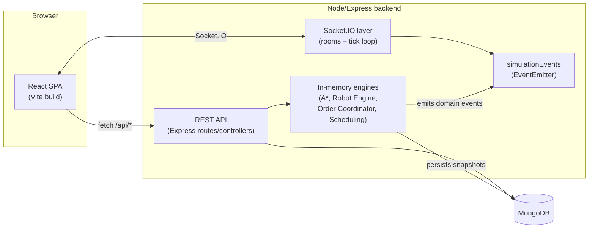
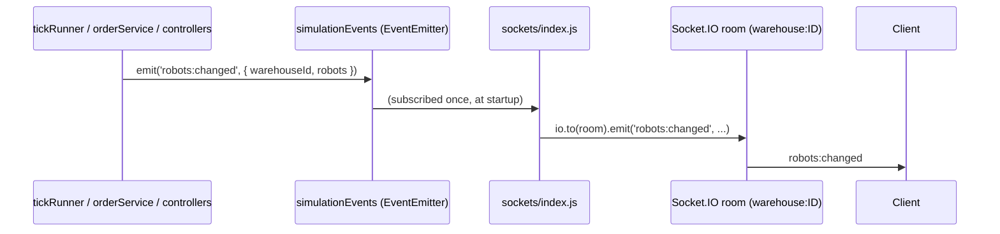

# Architecture

## System overview

```mermaid
flowchart LR
    subgraph Browser
        UI["React SPA<br/>(Vite build)"]
    end

    subgraph Backend["Node/Express backend"]
        REST["REST API<br/>(Express routes/controllers)"]
        IO["Socket.IO layer<br/>(rooms + tick loop)"]
        Engines["In-memory engines<br/>(A*, Robot Engine,<br/>Order Coordinator, Scheduling)"]
        Bus["simulationEvents<br/>(EventEmitter)"]
    end

    DB[(MongoDB)]

    UI -- "fetch /api/*" --> REST
    UI <-- "Socket.IO" --> IO
    REST --> Engines
    REST --> DB
    IO --> Bus
    Engines -- "emits domain events" --> Bus
    Engines -- "persists snapshots" --> DB
```

Two ways in, one shared core. REST handles CRUD and one-off actions
(create a warehouse, spawn a robot, run a single A* query). Socket.IO
handles everything that happens *continuously* while a simulation is
running. Both go through the same in-memory engines - there's exactly one
implementation of "what a tick does," "how A* searches," and "how a robot
picks its next task," not two versions that could drift apart.

## Component responsibilities

| Layer | Where | Responsibility |
|---|---|---|
| Frontend state | `frontend/src/state/` | React hooks owning grid editing, live simulation state, AI visualisation, keyboard shortcuts - one hook per concern, each documented with why it's shaped the way it is |
| Frontend rendering | `frontend/src/components/simulation/GridCanvas.jsx` | Single `<canvas>`, viewport-culled, `requestAnimationFrame`-batched - see the Milestone 14 review in the [development log](./DEVELOPMENT_LOG.md) for why this was left alone rather than "optimized" without evidence |
| REST layer | `backend/src/routes/`, `controllers/` | Request validation (`express-validator`), thin controllers that call services/engines and format the response envelope |
| Real-time layer | `backend/src/sockets/` | Room membership, the server-owned per-warehouse tick loop (`tickLoopManager.js`), forwarding `simulationEvents` to the right room |
| Event bus | `backend/src/events/simulationEvents.js` | A plain `EventEmitter` decoupling the engines from Socket.IO - see [Real-time layer](#real-time-layer) below |
| Services | `backend/src/services/` | Bridge the pure, Mongo-agnostic engines to MongoDB: `simulationManager` (engine instance cache), `orderService` (order lifecycle + persistence), `tickRunner` (one tick, shared by the REST endpoint and the automatic loop) |
| Engines | `backend/src/engine/` | Pure, synchronous, no I/O: grid, A* pathfinding, robot state machine, order coordination, scheduling strategies, dynamic obstacles. Every one of these is unit-tested in isolation and reusable outside a request/tick context - see `backend/scripts/benchmark.js`, which drives them directly with no MongoDB or HTTP involved at all |
| Persistence | `backend/src/models/` | Mongoose schemas - see [`ER_DIAGRAM.md`](./ER_DIAGRAM.md) |

## The tick loop

> The simulation core - state ownership, the concurrency model, the two
> state machines, restart recovery, and Socket.IO resynchronisation - is
> documented in full in
> [`SIMULATION_ARCHITECTURE.md`](./SIMULATION_ARCHITECTURE.md). This
> section is the short version.

A "tick" is one simulation step: move every robot, process any
pickup/delivery transitions that just happened, dispatch newly-idle
robots onto pending orders. `tickRunner.runTick(warehouseId, deltaSeconds)`
is the single implementation of this, called from two places:

- **`POST /warehouses/:id/tick`** - one manual step, useful for scripting
  or testing without a socket connection.
- **The server-owned tick loop** (`sockets/tickLoopManager.js`) - one
  `setInterval` per warehouse, shared by every client watching it, started
  by a `simulation:start` Socket.IO event and stopped either explicitly
  or automatically once nobody's left watching. This replaced an earlier,
  client-driven design (each browser tab running its own timer and
  calling the REST endpoint repeatedly) - see the Milestone 11 entry in
  the [development log](./DEVELOPMENT_LOG.md) for the full reasoning. The
  practical effect: the simulation keeps running for every other viewer
  even if whoever clicked "Start" closes their tab.

Every changed robot snapshot from a tick is persisted in one
`Robot.bulkWrite` call rather than one write per robot (Milestone 14) -
see [`backend/scripts/benchmark.js`](../backend/scripts/benchmark.js) for
measured throughput at the target scale of 50 simultaneous robots.

Both entry points, and every other operation that mutates one warehouse's
simulation, run through that warehouse's serialized queue
(`services/warehouseLock.js`), so no two of them are ever in flight at
once. Automatic ticks that arrive while one is still running are dropped
rather than queued, so a slow tick cannot build a backlog that later
replays as a burst - see
[the concurrency model](./SIMULATION_ARCHITECTURE.md#3-concurrency-model).

## Real-time layer

```mermaid
sequenceDiagram
    participant Tick as tickRunner / orderService / controllers
    participant Bus as simulationEvents (EventEmitter)
    participant Sockets as sockets/index.js
    participant Room as Socket.IO room (warehouse:ID)
    participant Client

    Tick->>Bus: emit('robots:changed', { warehouseId, robots })
    Bus->>Sockets: (subscribed once, at startup)
    Sockets->>Room: io.to(room).emit('robots:changed', ...)
    Room->>Client: robots:changed
```

`simulationEvents` is a plain Node `EventEmitter` that every engine-facing
module (`tickRunner`, `orderService`, the warehouse/robot controllers)
emits into. `sockets/index.js` is the *only* thing that listens,
translating each event into a broadcast to the matching warehouse's room.
This indirection is why most of the backend suite never needs to know
Socket.IO exists: they mock the services directly and never load the
sockets module, so emitting into an unlistened bus is a no-op. See the
event catalogue in [`API.md`](./API.md#socketio-events).

## Pathfinding

`astarSteps` (a generator) is the one A* implementation, used two ways:

- **`findPath`** drains it for just the final result - what the Robot
  Engine calls on every tick for every robot that's moving or being
  replanned. As of Milestone 14 this passes `emitSteps: false`, so the
  whole search runs inside a single generator resumption with no
  per-node snapshot built at all (a 54.8x speedup on a search exploring
  ~1,800 nodes - see the development log).
- **`findPathWithTrace`** drains it while collecting every yielded
  snapshot (`trace: true`), capped at 400 recorded frames regardless of
  how long the search actually runs. This is what powers the AI
  Visualisation Panel's step-by-step scrubber. The cap is now passed into
  the generator as `maxEmitSteps`, so snapshots past it are never built
  rather than built and discarded.

Start, goal and grid dimensions are validated before the search runs -
a fractional, non-finite or out-of-bounds coordinate names a cell this
grid search can never reach, and is answered in constant time instead of
after exhausting the iteration ceiling. See
[A* architecture](./SIMULATION_ARCHITECTURE.md#8-a-architecture).

Both paths share the same search - there's no risk of the "fast" and
"visualized" versions of A* disagreeing, because they're the same code
with different amounts of bookkeeping attached.

## Frontend state shape

One hook per concern, each independently documented in its own file:

- `useSimulationGrid.js` - the grid itself, the active editing tool,
  saved-layout management (Milestone 13), backend sync
- `useLiveSimulation.js` - Socket.IO-driven robots/orders/obstacles/
  notifications for whichever warehouse is currently synced
- `usePathVisualization.js` - the AI Visualisation Panel's pick-mode,
  traced-search request, and step playback
- `useKeyboardShortcuts.js` - global shortcuts, careful to avoid
  colliding with the canvas's own key handling (see the Milestone 14 bug
  fix in the development log)

`GridCanvas.jsx` is the single rendering surface all of these feed into -
grid cells, robots, dynamic obstacles, the A* search overlay, and the
heatmap are drawn in that order, each gated behind its own prop so any
combination can be shown or hidden independently.

## Known limitations

Documented here rather than silently left for someone to discover:

- **A robot spawned via `POST /robots` doesn't retroactively join an
  already-cached live engine.** `simulationManager.getEngine` only seeds
  a warehouse's in-memory robot list from MongoDB on a cache miss (first
  access after a server restart, or after the warehouse's layout
  changes). A robot created after that point exists in the database and
  shows up in every connected client's roster (the `robots:changed`
  event still fires), but won't actually move until the engine cache is
  next rebuilt. Flagged in Milestone 11, not fixed since the fix would
  require touching `robot.controller.js`'s `create` handler in a way
  that risked hanging the existing test suite (see that milestone's entry
  in the development log for the full reasoning).
- **`Robot.taskQueue` in the schema isn't the live source of truth.** The
  Robot Engine keeps its own in-memory task queue of plain
  `{x, y}` destinations during simulation; the schema field is reserved,
  not currently written by the running simulation. See the field's own
  comment in `Robot.js`.
- **Canvas rendering is not covered by any automated test.** The frontend
  now has 317 Vitest tests and 17 Playwright end-to-end specs (see
  [`FRONTEND_ARCHITECTURE.md`](./FRONTEND_ARCHITECTURE.md#6-testing)), but
  jsdom has no 2D context and Playwright can only assert that the canvas
  element exists - not what was drawn on it. `GridCanvas.jsx` therefore
  sits at ~45% coverage and rendering regressions are still caught by
  looking, not by CI.

## Security notes

Superseded by [`SECURITY.md`](./SECURITY.md), which is the authoritative
document. Summarised here because the rest of this file refers to it.

The project was originally built with no authentication at all: every REST
endpoint and every Socket.IO room was open to anyone who could reach the
server, and knowing (or guessing) a warehouse's ObjectId was enough to
read and modify it. The security phase replaced that with:

- **Cookie-based authentication** - short-lived JWT access tokens plus
  rotating, revocable refresh tokens, both in httpOnly cookies. bcrypt
  password hashing, per-IP and per-account login throttling, uniform
  responses so the login form is not an account-existence oracle.
- **Resource-level authorization** - every robot, order, obstacle,
  statistic and log reaches its owner through the warehouse it belongs to
  (`Warehouse.ownerId`). One middleware module answers every ownership
  question for both REST and Socket.IO; another user's resource returns
  `404`, indistinguishable from one that never existed.
- **Allow-list DTOs on every write path**, so `ownerId`, `role`,
  simulation state, and server-recorded timestamps are not client-settable.
- **Shared domain state machines** for the order and robot lifecycles, so
  the generic CRUD endpoints cannot bypass rules the simulation engine
  enforces.
- **Socket.IO handshake authentication**, per-event authorization, payload
  validation, and per-socket event rate limiting.
- **Tiered HTTP rate limiting**, strict CORS with no wildcard-plus-
  credentials, Helmet, and double-submit CSRF protection.

CORS remains a browser-enforced mechanism rather than an access control -
a direct `curl` request is not subject to it. That is no longer the
problem it was, because `requireAuth` now gates every route regardless of
where the request came from.

What is still *not* covered - email verification, password reset, MFA,
sharing between accounts, and security-event audit logging - is listed
with the rest of the residual risk in
[`SECURITY.md`](./SECURITY.md#10-threat-model).
