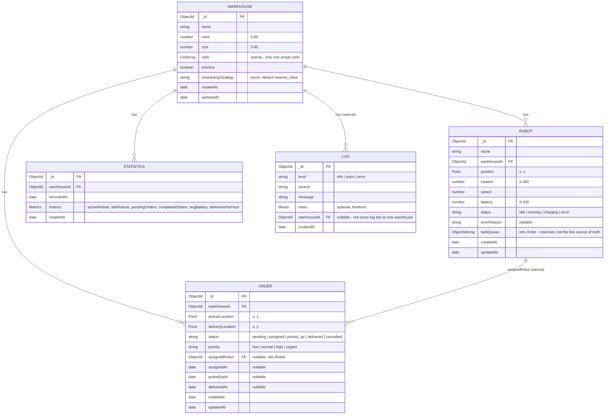

# Entity-Relationship Diagram

Five MongoDB collections, one per Mongoose model in
[`backend/src/models`](../backend/src/models). Everything is scoped to a
`Warehouse` by an ObjectId reference (`warehouseId`) - there's no
relational join at the database level; the app reads related documents
with separate queries (see [`ARCHITECTURE.md`](./ARCHITECTURE.md) for why
that's a fine trade-off at this scale).

## Notes on the relationships

- **`Robot.taskQueue` is a schema field, not the live source of truth.**
  The Robot Engine (in-memory, per warehouse) keeps its own task queue of
  plain `{x, y}` destinations during simulation and doesn't persist it -
  see the comment on that field in `Robot.js`. It's reserved for a future
  use, not currently written by the running simulation.
- **`Order.assignedRobot` is the only cross-reference besides
  `warehouseId`.** Set when `dispatchPendingOrders` assigns an order,
  cleared implicitly once the order reaches `delivered`/`cancelled` (the
  order itself is the historical record; nothing un-sets the field
  retroactively).
- **`Log.warehouseId` is nullable** - a log entry can be
  warehouse-scoped (most are: robot errors, deliveries) or global
  (server-level events), which is why it's optional rather than required
  like the others.
- **No cascading deletes.** Deleting a `Warehouse` does not delete its
  robots/orders/statistics/logs - see the security/data-integrity note in
  [`ARCHITECTURE.md`](./ARCHITECTURE.md#known-limitations) for why that's
  a known, accepted limitation rather than an oversight.

## Indexes

| Collection | Index | Supports |
|---|---|---|
| Warehouse | `{ isActive: 1 }` | Filtering the active layout |
| Robot | `{ warehouseId: 1, status: 1 }` | Listing a warehouse's robots by status |
| Order | `{ warehouseId: 1, status: 1 }` | Listing a warehouse's pending/assigned orders |
| Statistics | `{ warehouseId: 1, recordedAt: -1 }` | Recent snapshots for a warehouse |
| Log | `{ createdAt: -1 }`, `{ level: 1, source: 1 }`, `{ warehouseId: 1, createdAt: -1 }` | Recent logs globally, by level/source, or scoped to one warehouse (the last one added in Milestone 14 once the Logs panel started actually using that filter - see the [development log](./DEVELOPMENT_LOG.md)) |
