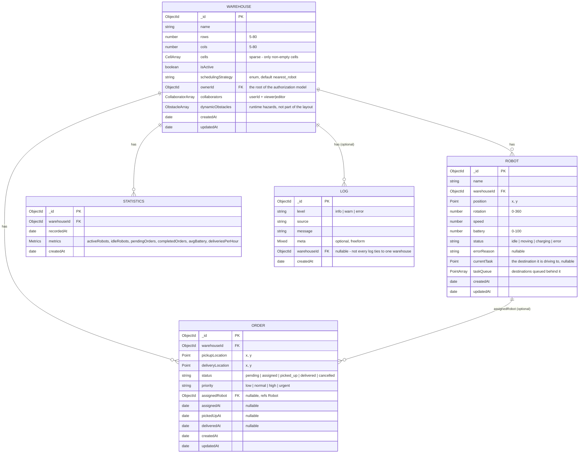

# Entity-Relationship Diagram

One collection per Mongoose model in
[`backend/src/models`](../backend/src/models). The five below are the
simulation's own; the account-side collections (`User`, `RefreshToken`,
`VerificationToken`, `SecurityEvent`, `SimulationLease`) are documented in
[`SECURITY.md`](./SECURITY.md) instead, because they answer a different
question and are never reachable through the warehouse.

Everything here is scoped to a `Warehouse` by an ObjectId reference
(`warehouseId`) - there's no relational join at the database level; the app
reads related documents with separate queries (see
[`ARCHITECTURE.md`](./ARCHITECTURE.md) for why that's a fine trade-off at
this scale).

```mermaid
erDiagram
    WAREHOUSE ||--o{ ROBOT : "has"
    WAREHOUSE ||--o{ ORDER : "has"
    WAREHOUSE ||--o{ STATISTICS : "has"
    WAREHOUSE ||--o{ LOG : "has (optional)"
    ROBOT ||--o{ ORDER : "assignedRobot (optional)"

    WAREHOUSE {
        ObjectId _id PK
        string name
        number rows "5-80"
        number cols "5-80"
        CellArray cells "sparse - only non-empty cells"
        boolean isActive
        string schedulingStrategy "enum, default nearest_robot"
        ObjectId ownerId FK "the root of the authorization model"
        CollaboratorArray collaborators "userId + viewer|editor"
        ObstacleArray dynamicObstacles "runtime hazards, not part of the layout"
        date createdAt
        date updatedAt
    }

    ROBOT {
        ObjectId _id PK
        string name
        ObjectId warehouseId FK
        Point position "x, y"
        number rotation "0-360"
        number speed
        number battery "0-100"
        string status "idle | moving | charging | error"
        string errorReason "nullable"
        Point currentTask "the destination it is driving to, nullable"
        PointArray taskQueue "destinations queued behind it"
        date createdAt
        date updatedAt
    }

    ORDER {
        ObjectId _id PK
        ObjectId warehouseId FK
        Point pickupLocation "x, y"
        Point deliveryLocation "x, y"
        string status "pending | assigned | picked_up | delivered | cancelled"
        string priority "low | normal | high | urgent"
        ObjectId assignedRobot FK "nullable, refs Robot"
        date assignedAt "nullable"
        date pickedUpAt "nullable"
        date deliveredAt "nullable"
        date createdAt
        date updatedAt
    }

    STATISTICS {
        ObjectId _id PK
        ObjectId warehouseId FK
        date recordedAt
        Metrics metrics "activeRobots, idleRobots, pendingOrders, completedOrders, avgBattery, deliveriesPerHour"
        date createdAt
    }

    LOG {
        ObjectId _id PK
        string level "info | warn | error"
        string source
        string message
        Mixed meta "optional, freeform"
        ObjectId warehouseId FK "nullable - not every log ties to one warehouse"
        date createdAt
    }
```

## Notes on the relationships

- **`Robot.currentTask` and `Robot.taskQueue` are the robot's work,
  persisted.** They used to be a reserved schema field of `Order`
  references that the running simulation never wrote, while the engine kept
  the real queue in memory - so the schema described a data model the
  application did not have, and every restart threw the fleet's work away.
  They now hold plain `{x, y}` destinations written from the engine
  snapshot on every persist and read back when an engine is built.

  What is still *not* persisted is the computed A\* path, deliberately: a
  destination stays true across an outage, a path is a plan against a world
  that may have changed. See
  [`SIMULATION_ARCHITECTURE.md`](./SIMULATION_ARCHITECTURE.md#6-recovery-model).
- **`Order.assignedRobot` is the only cross-reference besides
  `warehouseId`, and it never dangles.** Set when `dispatchPendingOrders`
  assigns an order, alongside `assignedRobotName` - a *copy* of the name,
  not a reference.

  The copy is what makes the reference safe to drop. A delivered order
  outlives the robot that delivered it, so the pointer used to be left
  aimed at a document that no longer existed: it populated to null and the
  history simply lost who did the work. Deleting a robot now clears
  `assignedRobot` on its finished orders, and the name carries the fact
  forward. History is a statement about the past, and the point of one is
  that it does not change when the present does.
- **`Log.warehouseId` is nullable** - a log entry can be
  warehouse-scoped (most are: robot errors, deliveries) or global
  (server-level events), which is why it's optional rather than required
  like the others.
- **Deleting a `Warehouse` cascades.** Its robots, orders, statistics and
  logs go with it, children before parent and without a transaction
  (MongoDB transactions need a replica set this deployment does not have),
  so a process that dies part-way leaves everything still reachable and
  still owned, and repeating the request finishes the job.

  Hard delete rather than soft, deliberately. A soft delete earns its
  complexity when something still needs to read the deleted thing - undo,
  audit, billing - and nothing here does; every read path would grow an
  `isDeleted` term that is one forgotten filter away from leaking deleted
  data back into a listing. See `warehouse.controller.js` for the full
  reasoning.

- **`Warehouse.dynamicObstacles` is runtime state that is nonetheless
  stored.** Hazards are not part of the saved *layout* - editing the floor
  plan does not touch them - but they were previously the one piece of
  simulation state with no home at all, lost on every restart and not
  covered by database-level access control. Storing them on the warehouse
  means the engine load that already reads that document restores them for
  free, with no extra query and no second authorization path to get wrong.

## Indexes

| Collection | Index | Supports |
|---|---|---|
| Warehouse | `{ ownerId: 1 }`, `{ ownerId: 1, isActive: 1 }`, `{ 'collaborators.userId': 1 }` | Scoping every read to its owner, filtering the active layout, and listing warehouses shared *with* a user (the membership half of that `$or` would otherwise be a collection scan on every list request) |
| Robot | `{ warehouseId: 1, status: 1 }` | Listing a warehouse's robots by status |
| Order | `{ warehouseId: 1, status: 1 }` | Listing a warehouse's pending/assigned orders |
| Statistics | `{ warehouseId: 1, recordedAt: -1 }` | Recent snapshots for a warehouse |
| Log | `{ createdAt: -1 }`, `{ level: 1, source: 1 }`, `{ warehouseId: 1, createdAt: -1 }` | Recent logs globally, by level/source, or scoped to one warehouse (the last one added in Milestone 14 once the Logs panel started actually using that filter - see the [development log](./DEVELOPMENT_LOG.md)) |
