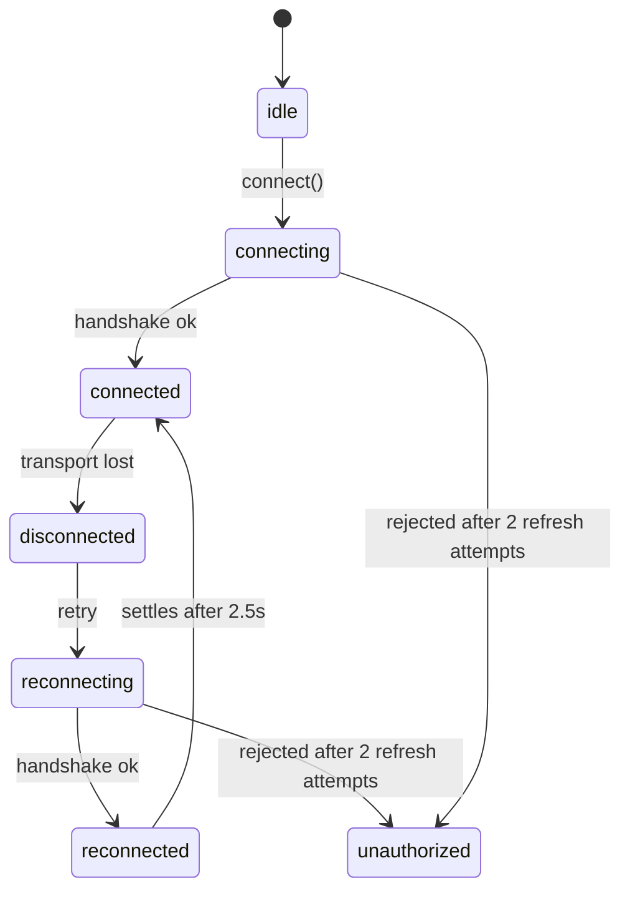

# Frontend architecture

How the dashboard stays honest about a system it does not own: which state
belongs to the server and which is the client's own, what the live
connection is actually doing at any moment, and what every surface shows
when the answer is "we don't know yet" or "that failed".

[`ARCHITECTURE.md`](./ARCHITECTURE.md) covers the system as a whole and
[`SIMULATION_ARCHITECTURE.md`](./SIMULATION_ARCHITECTURE.md) the simulation
core. This document is only about `frontend/`, and it is the reference the
components are written against.

---

## 1. State ownership

The client mirrors a simulation it cannot control. Almost every bug this
design exists to prevent came from code that forgot which half it was
touching.

| State | Owner | Lives in | Notes |
|---|---|---|---|
| Robots, orders, obstacles, is-it-running | **Server** | `state/simulationReducer.js` | Mirrored, never invented. Only server events may write it. |
| Counts, averages, utilisation | **Derived** | Computed on render | Never stored, so it cannot disagree with what it came from. |
| Chart history, traffic heatmap, notification feed | **Client** | `state/useLiveSimulation.js` | Exists only in the browser; cleared when the warehouse changes. |
| Grid layout being edited, tool, selection | **Client** | `state/useSimulationGrid.js` | A draft until "Sync Layout to Server"; the server has never heard of it before that. |
| A\* start/goal picking and step playback | **Client** | `state/usePathVisualization.js` | A trace request is server-computed; stepping through it is local. |
| Who is signed in | **Server** | `state/useAuth.jsx` | Session lives in httpOnly cookies this code cannot read. |
| Socket status, API reachability | **Transport** | `api/realtime.js`, `state/useConnection.js` | Two separate facts - see §2. |

The three that used to be one were the problem: nine `useState` calls side
by side in a single hook, written from a dozen socket callbacks, with
nothing to say which ones a given event was allowed to touch. Collecting
the server half behind a reducer makes ownership explicit, and makes every
transition testable without a socket or a React tree.

### The staleness rule

Two sources describe the same robots: a REST snapshot (whatever MongoDB
held when the request went out) and a socket `simulation:sync` (the live
engine's sub-tick-accurate view). They can resolve in either order.

The reducer therefore records `hasSocketSync`, and **a REST snapshot that
arrives after a socket sync is discarded** rather than applied - applying
it would visibly rewind every robot to where it was one round trip ago.
Orders are the exception: they are not part of a socket sync (the server
sends an invalidation instead), so that half of a late snapshot is still
the freshest thing available and is kept.

Resyncs **replace** robots and obstacles rather than merging them. The
point of a resync is that whatever this client accumulated may be wrong;
merging would preserve exactly the stale entries it exists to discard - a
robot deleted while the tab was disconnected, which no future
`robots:changed` event will ever mention again.

`syncedAt` starts as `null`, meaning "the server has never told us
anything". That is deliberately not the same value as "the server says
there is nothing", and the UI distinguishes them.

---

## 2. The connection is a lifecycle, not a boolean

`api/realtime.js` wraps the socket in a state machine, because "connected"
and "disconnected" cannot express the three situations a person actually
needs to tell apart: still connecting, lost it and retrying, and your
session is gone so retrying will never work.



`reconnected` is a real state and not cosmetic: it is how the UI can say
"back online" for long enough to read before settling to the steady state.
`unauthorized` is terminal - only a fresh sign-in leaves it.

Three problems this fixed, all of which only appear on a bad network,
which is exactly when they matter:

- **The session could expire out from under the socket.** The handshake
  authenticates once, from an access cookie that lives 15 minutes.
  socket.io reconnects on its own and re-sends the *same* expired cookie,
  forever. REST kept working (it refreshes on a 401), so the app looked
  alive while the live view had silently stopped updating. The manager now
  refreshes the session and reconnects - the socket equivalent of the REST
  client's retry, sharing the same serialised refresh so the two can never
  rotate the refresh token twice in parallel. It gives up after two
  attempts, because a third would be noise rather than recovery.
- **Rejoining rooms was every consumer's job.** The server drops room
  membership on disconnect and its broadcasts are fire-and-forget, not a
  replayable stream, so one listener that forgot to re-emit
  `warehouse:join` meant a permanently stale panel. Rejoining is now a
  property of the connection: whatever is registered gets rejoined, once
  per room, by one listener.
- **Nothing could describe what was happening.** Hence the state machine
  above, read by the UI through `useSyncExternalStore`.

### Two connections, reported separately

The status pill used to be one string fed by both the `/health` poll and
the socket, which made it reliably wrong: losing the socket set it to
"offline" though every REST call still worked, and ten seconds later the
health poll set it back to "online" while the live view was still dead.
They are different facts about different transports, so `useConnection.js`
reports two.

---

## 3. One error type

Three shapes used to reach the UI: an `Error` carrying the server's
message, a raw `TypeError: Failed to fetch` when the network was down, and
a bare payload object over Socket.IO. Panels rendered whichever they got,
verbatim, so "Failed to fetch" - which tells a user nothing and suggests
no next step - was a normal thing to see.

Everything crossing the network boundary is now an `ApiError` with a
`status` (`0` meaning no HTTP response at all: DNS, offline, CORS, server
down) and predicates like `isUnauthorized` and `isRateLimited`. One place
turns that into a sentence worth reading, so no panel has to re-derive
what a 401 or a 429 means.

---

## 4. Nothing renders as a blank space

`components/common/Feedback.jsx` covers the four things a panel says when
it has nothing to show - loading, failed, empty, needs attention - because
each panel used to spell these out with a bare `<p>`. An empty list, a
first load and a hard error were visually identical, none of them told a
screen reader anything had changed, and only some suggested a next step.
Errors render `aria-live="assertive"` and carry an action; everything else
is `polite`.

`components/common/ErrorBoundary.jsx` stops one broken panel from taking
the dashboard with it. Without a boundary a render error anywhere unmounts
the whole tree and leaves a blank page - no navigation, no sign-out, no
indication anything happened - and that is plausible here, because panels
render server data whose shape this client does not control. Boundaries
wrap the app root and each panel independently, so a malformed order kills
the orders panel and nothing else. It deliberately does not report to a
telemetry service: there is no such backend in this project, and inventing
one would be scope nobody asked for.

---

## 5. Component structure

`ControlPanel.jsx` was one component owning simulation transport, grid
sizing, layout generation, server sync, strategy selection and obstacle
management. It is now three - `SimulationControls`, `WarehouseControls`,
`ObstaclesPanel` - split along what each one talks to rather than where
they happen to sit on screen, which is also what makes them individually
testable.

Shared vocabulary (status labels, coordinate and battery formatting) lives
in `utils/format.js`. It was previously re-declared per component:
`STATUS_LABEL` existed in the sidebar and again, differently and covering
fewer cases, in the orders panel; coordinates were interpolated inline in
five places with three roundings. One file is the difference between a
dashboard and five dashboards sharing a page.

---

## 6. Testing

Three layers, each catching what the layer below structurally cannot.

| Layer | Runner | Count | What only it can see |
|---|---|---|---|
| Unit | Vitest + jsdom | 395 across 19 files | Reducer transitions, the connection state machine, formatting, the grid engine, the canvas scene, the generated CSP - no React tree or server needed |
| Integration | Vitest + Testing Library | 21 of those 395 (`tests/integration`) | The seams *between* hooks, panels and the transport, with only `fetch` and the socket replaced |
| End-to-end | Playwright + Chromium | 17 across 2 specs | A cookie never actually set, a CORS policy blocking the handshake, a CSRF header the server rejects - all invisible in jsdom, where the network is a mock |

The bugs this phase fixed - a socket that never recovered from an expired
session, a snapshot race that rewound robot positions, commands silently
buffered while offline - all lived in those seams, where a unit test with
everything mocked sees nothing. That is why the integration layer mocks
only the two transports and runs the real auth provider, connection
manager, state hooks and every panel.

Coverage is **87.9% of statements, 89.9% of lines** (`npm run
test:coverage`), up from 81.2% once the canvas stopped being unreachable.

The remaining gap is concentrated in `GridCanvas.jsx` (~51%), and it is
now a different gap from the one it used to be. What is still uncovered
there is *pointer and keyboard interaction* - drag-to-pan, wheel zoom,
click-to-paint - which needs real geometry and real events that jsdom does
not produce; those are exercised end to end in Playwright instead. What
used to be uncovered was the drawing itself, and that moved to
`renderScene.js`, which sits at 100%. `main.jsx` and the theme tokens stay
excluded: one is an entry point and the other is a table of constants.

`npm test` must stay runnable on a laptop with no database, so the e2e
suite is a separate `npm run test:e2e`. It drives a real browser against a
real stack, creates its own account and warehouse per run, and cleans up
after itself.

### Timeouts

`findBy*` defaults to a 1s ceiling. That is ample on an idle machine - the
whole suite runs in about 25 seconds - but this suite starts 16 jsdom
environments in parallel and jsdom setup alone is over half the wall time.
On a loaded machine the same run takes ~70s, and a normally-instant sign-in
can miss that window.

The failure mode is worse than one red test. `userEvent.type` is abandoned
mid-word when a test times out, and because it re-queries the DOM between
fields, its next query resolves against the *following* test's freshly
rendered form - so two sign-ins interleave character by character into one
input and that test fails too. `asyncUtilTimeout` is therefore 5s
(`tests/setup.js`) with a 20s `testTimeout` above it: still a real ceiling
on a hang, but not a stopwatch on how busy the host is.

---

## 7. Known limitations

Two of these are constraints. Two are decisions, and are listed here
because a reader deserves to know they were made on purpose rather than
overlooked - which is not the same thing as a gap.

### Constraints

- **Rendering is verified above the pixels, not at them.** The drawing
  logic is now pure functions of a scene object
  ([`renderScene.js`](../frontend/src/components/simulation/renderScene.js)),
  and a recording stand-in for the 2D context
  ([`tests/helpers/recordingContext.js`](../frontend/tests/helpers/recordingContext.js))
  checks the decisions: viewport culling, layer order, robot status
  colours, the battery ring's sweep, heatmap normalisation, and that every
  colour drawn comes from `theme.js`. What no test here can check is
  whether those calls produce the right *image* - that is screenshot
  diffing, it needs a real browser and a baseline, and it is the honest
  residue of the old "caught by looking" note.
- **Telemetry is one log line, not an observability stack.** A render
  error posts to this project's own API and becomes a `Log` entry the user
  can read in the Logs panel ([`telemetry.js`](../frontend/src/api/telemetry.js)).
  Nothing leaves the deployment, there is no session replay, no breadcrumb
  trail, no aggregation across users. The reporter deduplicates and caps
  itself, so a component failing on every tick reports once rather than
  twice a second - which also means a *recurring* failure looks identical
  to a single one in the log.

### Decisions

- **Offline is read-only, not queued.** Commands issued while disconnected
  are refused with a message rather than buffered and replayed. This is
  not a missing feature: a queued "start simulation" that fires four
  minutes later, against a warehouse whose layout has since changed and
  whose orders have been redispatched, is worse than a refusal the
  operator saw at the time. The state the commands would act on is
  server-owned and moves on without us.
- **One warehouse at a time.** The live view joins a single room. Watching
  two simultaneously would mean two socket rooms, two reducers, two
  heatmaps and a canvas that has to say which fleet is which - a different
  product, not a bigger version of this one. The constraint is in the
  layout, not in the transport: nothing in `realtime.js` or the reducer
  assumes it.

---

## Verifying this

```bash
cd frontend
npm run verify        # lint, typecheck, 395 unit/integration tests, production build
npm run test:coverage # the coverage figures quoted above

# e2e needs the backend and MongoDB running; Playwright starts Vite itself
npm run test:e2e:install   # once
npm run test:e2e
```
