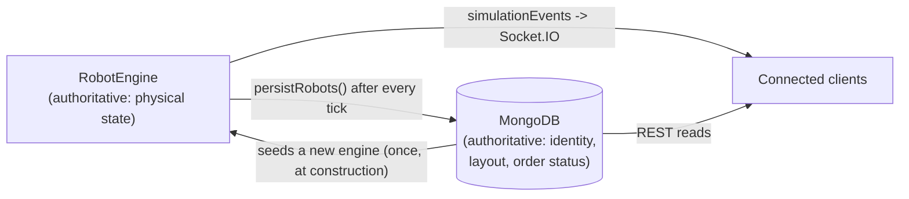
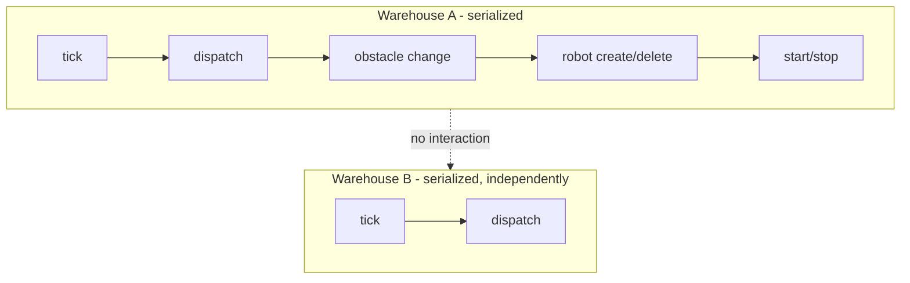
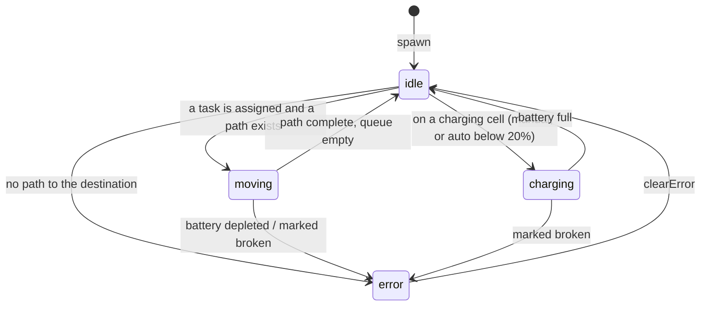
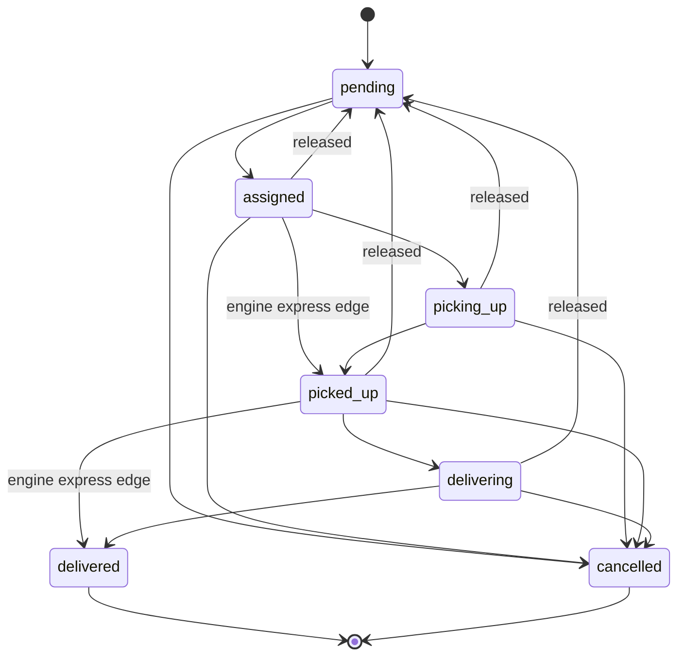
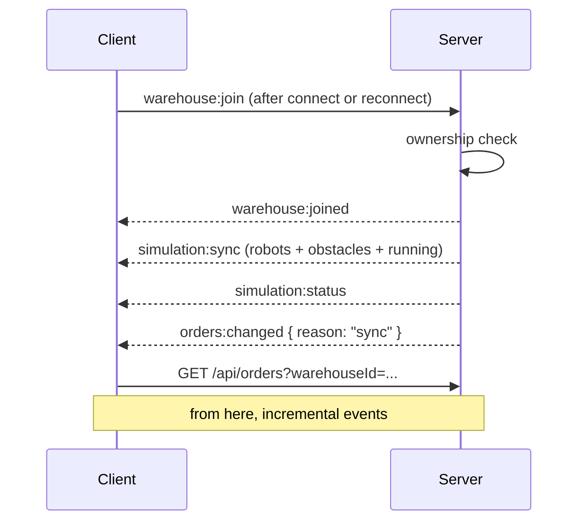

# Simulation architecture

How the live simulation actually works: who owns which piece of state, what
advances time, what stops two things happening at once, and what happens
when any of that is interrupted.

[`ARCHITECTURE.md`](./ARCHITECTURE.md) covers the system as a whole - this
document is only about the simulation core, and it is the reference for the
rules the rest of the code is written against.

---

## 1. Authoritative state

Everything in this application is either **persistent** (MongoDB knows it,
and it survives a restart) or **runtime** (the process knows it, and it does
not). Almost every bug this design exists to prevent came from a piece of
state that quietly belonged to both.

| State | Owner | Persisted? | Notes |
|---|---|---|---|
| Which warehouses/robots/orders exist | MongoDB | Yes | Identity and ownership. The engine is seeded from this; it never invents a robot. |
| Warehouse layout (`rows`, `cols`, `cells`) | MongoDB | Yes | Read once when an engine is built. Changing it rebuilds the engine. |
| `schedulingStrategy` | MongoDB | Yes | Re-read on every dispatch, so a change takes effect without a reload. |
| Robot identity (`name`, `speed`) | MongoDB | Yes | Client-editable through `PUT /api/robots/:id`. |
| **Robot position, rotation, battery, status** | **RobotEngine** | Written back each tick | Simulation-owned. The REST DTO refuses to write these at all. |
| **Robot task queue and current path** | **RobotEngine** | No | Plain `{x, y}` destinations, in memory only. |
| **Dynamic obstacles** | **DynamicObstacleManager** | No | Runtime hazards layered over the static grid, not part of the saved layout. |
| **Order ↔ robot assignment (which leg a robot is on)** | **OrderCoordinator** | No | This is the map that turns "a robot arrived" into "an order advanced". |
| Order lifecycle status | MongoDB | Yes | Written by the engine's tick path *and* the REST API, both through the same state machine. |
| Whether a simulation is running | TickLoopManager | No | One interval per warehouse, per process. |
| Logs and statistics snapshots | MongoDB | Yes | Append-only history. |

The flow is one-directional while a warehouse is loaded:



MongoDB therefore lags the engine by at most one tick, and is written *from*
it - never the other way round while an engine is loaded. The single moment
the arrow reverses is engine construction, and that is also the single
moment the two can disagree, which is what §6 is about.

Two consequences worth stating plainly, because they are choices and not
accidents:

- **Some runtime state is genuinely lost when an engine is dropped, and
  some is not.** A robot's *computed path* and the coordinator's in-memory
  assignments do not survive a restart or a layout change; its
  *destinations* and the warehouse's *dynamic obstacles* do, because both
  are persisted. The split is deliberate rather than incidental: a
  destination is a statement of intent that stays true across an outage,
  while a path is a plan against a world that may have changed. So a robot
  comes back knowing where it was going and works out afresh how to get
  there.
- **There is no optimistic-concurrency guard on the robot writes.** There
  does not need to be: while an engine is loaded it is the sole writer of
  physical state, and every write to it is serialized (§3). The REST API
  cannot write those fields at all.

---

## 2. The tick: one mechanism

`tickRunner.runTick(warehouseId, deltaSeconds)` is the only thing that
advances simulation time. One tick means, in order:

1. Expire any timed dynamic obstacles, then move every robot by
   `speed * deltaSeconds` (`engine.tick`).
2. Persist every changed robot in one `bulkWrite`, and broadcast them.
3. Turn arrivals into order events (`coordinator.processTick`) and persist
   those, each guarded by the order state machine.
4. Log and notify for any robot that entered the `error` state.
5. Dispatch pending orders onto newly-idle robots.
6. Broadcast the obstacle list, but only if it changed.

| Question | Answer |
|---|---|
| Who can trigger a tick? | `POST /api/warehouses/:id/tick` (one manual step, rate-limited, owner-only) and the server-owned interval loop started by `simulation:start`. Nothing else. |
| What happens when two ticks arrive together? | They are serialized by the warehouse lock (§3) and applied one after the other. Two ticks never interleave, and neither is lost. |
| What happens when an *automatic* tick arrives while one is running? | It is **dropped**, not queued (`runAutoTick`). Queueing would let a slow tick build a backlog that then replays as a burst of catch-up ticks, fast-forwarding the simulation. A dropped interval means that interval produced no motion, which is the honest outcome. |
| What happens when a tick fails? | The error propagates to the caller (a 500 for the REST endpoint), the lock is released, and the loop counts the failure and tries again next interval. A failed tick never wedges the warehouse. |
| What happens if a simulation is started twice? | The second start changes nothing - one interval per warehouse, never one per client - but it is acknowledged: the requester gets a `simulation:status` with `changed: false`. A client that hears nothing back cannot tell "already running" from "my request was dropped". The first start's cadence stays in effect. |
| What happens if it is stopped twice? | The same, in reverse: a reported no-op. "Stopped" is the state the caller asked for and the state they get. |
| How do automatic and manual ticking interact? | They share the lock, so a manual tick during automatic ticking is applied strictly *between* two automatic ticks. It is an extra step, never a step on top of a step. |

---

## 3. Concurrency model

**One FIFO queue per warehouse.** `services/warehouseLock.js`.

Node is single-threaded, but every simulation operation is `async` with at
least one `await` between reading state and writing it back - and an `await`
is a yield point. Before the lock, a REST tick landing while the interval
loop was mid-tick, a dispatch racing the tick that triggered it, or an
obstacle added while a robot was being replanned around the *old* obstacle
set all interleaved freely, each assuming it was the only writer.

Warehouses are fully independent - nothing in this simulation spans two of
them - so serializing per warehouse costs nothing in throughput while making
every operation on a single warehouse atomic with respect to every other.



Everything that mutates one warehouse's simulation goes through it:

| Operation | Entry point |
|---|---|
| Tick (manual and automatic) | `tickRunner.runTick` / `runAutoTick` |
| Dispatch | `orderService.dispatchPendingOrders` |
| Robot create / delete | `POST /api/robots`, `DELETE /api/robots/:id` |
| Robot task / charge / clear-error / break | `POST /api/robots/:id/{tasks,charge,clear-error,break}` |
| Obstacle add / remove | `POST`/`DELETE /api/warehouses/:id/obstacles` |
| Layout change and warehouse delete | `PUT`/`DELETE /api/warehouses/:id` |

Three details that matter:

- **Re-entrancy is avoided by construction, not detected.** `runTick`
  already holds the lock when it dispatches, so it calls
  `dispatchPendingOrdersLocked` - the same work without the lock. Calling
  the public `dispatchPendingOrders` there would deadlock, and the two names
  are the reason nobody does it by accident.
- **The queue is bounded** at 32 waiting operations. Past that, callers get
  a `503` instead of being queued. A backlog that deep means work is
  arriving faster than the simulation can absorb it, and queueing it anyway
  converts a burst of requests into unbounded memory growth and
  ever-staler responses.
- **A rejection releases the lock.** The chain continues past a failed
  operation, so one bad tick cannot wedge a warehouse for the life of the
  process.

This is deliberately a single-process, in-memory lock, and it stays one. It
serialises operations *within* one process, which is the right scope,
because a lock is only meaningful over state it can actually protect and
the engines are per-process.

What used to be missing is the layer above it: nothing stopped a *second*
process from loading the same warehouse and ticking it too, with its own
engines and its own lock, so the two silently wrote over each other. That
is now handled where it belongs - not by making this lock distributed, but
by deciding which process may advance a given warehouse at all
(`services/instanceLease.js`). One instance holds the lease, renews it as
it ticks, and every other instance declines. Within the holder, this lock
does exactly what it always did. See
[Known limitations](#10-known-limitations).

### One engine per warehouse

`simulationManager` caches the **promise** of an engine, not the resolved
instance. With a plain instance cache, `getEngine` had an `await` between
"is it cached?" and "cache it", so two callers arriving together both missed,
both built a `RobotEngine`, and both wrote it to the map. The loser's engine
went on existing as a detached second simulation of the same warehouse, with
robots that nothing would ever tick again. Caching the in-flight promise
makes the first caller the only builder and every concurrent caller a
subscriber to it. The `OrderCoordinator` is validated against the engine it
was built for, so it can never end up driving a previous generation's fleet.

---

## 4. Robot state machine

Declared once in `domain/robotLifecycle.js`, and now enforced on both sides:
the REST layer checks it, and `RobotEngine._setStatus` asserts it on every
internal transition. Before that, the engine assigned `robot.status`
directly in eight places, so the table described the side door and not the
front one.



| Situation | Behaviour |
|---|---|
| Movement | Distance budget of `speed * deltaSeconds` is spent across the path, across as many waypoints and queued tasks as it covers, with interpolated positions in between. |
| Blocked by another robot | Holds position (`isWaiting`). After 3 consecutive blocked ticks it replans around the congestion, which is what breaks a head-on standoff. |
| Dynamic obstacle or a broken robot on the path | Replans immediately - neither is expected to clear on its own. |
| Battery depletion | Stops in `error`, **parked on the whole cell it last fully entered**, with the interrupted destination pushed back to the front of the queue. |
| Low battery | An idle robot at or below 20% routes itself to the nearest *reachable* charging station. Never preempts an explicitly queued destination. |
| Unreachable destination | `error`, with the destination kept queued so it is retried after `clearError` rather than silently dropped. |
| Task completion | Falls through to the next queued destination in the same tick if budget remains. |
| Task failure | See the order machine below - a failed robot releases its order. |
| Collisions | Impossible by construction: a robot only ever advances into a cell no other robot currently occupies, checked at every waypoint boundary rather than once per tick. |

Two rules exist because breaking them produced real bugs:

- **A robot at rest is always on a whole cell.** Positions are fractional
  only *while* moving. `_drainBattery` and `markBroken` snap to
  `currentCell`, and planning starts from `currentCell`, never `position`.
  A* is a grid search, so a fractional start names a node it can never
  reach: it explored an entire lattice offset from the real grid and then
  reported "no path" for a plainly reachable destination. This was
  reachable in production via `clearError` on a robot whose battery ran out
  mid-step.
- **The task queue is capped** at 64 destinations. `POST /api/robots/:id/tasks`
  is a client-driven path into it, and every entry is re-planned as the
  robot works through it.

---

## 5. Order state machine

Declared once in `domain/orderLifecycle.js`. The REST API validates against
it directly; the simulation's tick path expresses the same rule as a query
filter (`status: { $in: predecessorsOf(next) }`), so an illegal move matches
no document rather than being applied and then noticed. That is what lets a
tick already in flight fail safely against an order the user just cancelled.



The engine observes a robot only at the moment it *arrives* somewhere, so it
advances an order a full leg at a time - hence the two "express" edges.
`picking_up` and `delivering` remain available to API clients driving an
order by hand.

**The release edges** (`* -> pending`) were added in this phase, and are the
important part. Every one of them clears `assignedRobot`, `assignedAt` and
`pickedUpAt`; none of them can reach `delivered`, which stays terminal and
only ever reachable from an actual delivery. They exist because an order
could previously become permanently stranded - not terminal, so it stayed
`picked_up` forever, pointing at a robot that was no longer carrying it,
while the dispatcher only ever looks at `pending`. Four things now release
an order instead of stranding it:

| Trigger | Path |
|---|---|
| The robot carrying it failed (flat battery, marked broken, route cut off) | `order_failed` event → back to `pending` |
| The delivery point became unreachable after pickup | `delivery_unreachable` event → back to `pending` |
| The robot was deleted | `orderService.releaseOrdersForRobot` |
| The engine was rebuilt (restart, layout change) | `simulationManager.reconcileWarehouse` |

Cancelling or un-assigning an order through the REST API also reaches the
simulation: the coordinator's assignment is dropped *and* the robot's queued
destinations are cleared, so it stops driving toward a delivery nobody is
waiting on.

**Robots cannot be assigned impossible tasks.** The scheduler only considers
idle, unassigned robots above the low-battery threshold; `assignOrder`
re-checks that independently and refuses a robot that is already on an order
or not idle; and an order whose pickup point is unreachable is left
`pending` rather than marked `assigned`.

---

## 6. Recovery model

**Reconstruct from persistence, then reconcile.** No snapshot file, no
event log, no replay.

Every engine is built by `simulationManager._loadEngine`, which is also the
only place the two halves of the system can disagree - so that is where the
disagreement is resolved. It runs on a genuine process restart and on any
cache invalidation (a layout change), because both lose exactly the same
runtime state and both need exactly the same fix.

| Persisted state | What happens on load |
|---|---|
| Robot `idle` | Loaded as-is. |
| Robot `moving` | Loaded **idle** at its last cell. Its path lived only in memory and the world may have changed under it; it is re-dispatched normally. Mongo is corrected. |
| Robot persisted mid-cell (fractional position) | Snapped to the nearest whole cell, and Mongo corrected. Without this the spawn was rejected and a restart mid-move silently dropped the robot from the fleet. |
| Robot `charging`, still on a charging cell | Resumes charging. |
| Robot `charging`, no longer on a charger | Loaded idle. |
| Robot `error` | Stays broken. A restart is not a repair. |
| Robot with a persisted `currentTask` / `taskQueue` | Destinations restored, `currentTask` first. An idle robot starts driving again; a charging or broken one keeps the queue and resumes through the normal paths. A destination the layout has since made unreachable is kept, not dropped - the robot lands in `error` with a reason, which is visible and retryable. |
| Dynamic obstacles stored on the warehouse | Restored *before* the fleet, so a robot whose saved cell is now under a construction zone is judged against the world as it actually is. Anything already expired is dropped rather than resurrected. |
| Robot on a cell that is no longer walkable, or contended by another robot | Left out of the engine, and marked `error` in Mongo with the reason. Previously it was dropped silently - absent from the simulation, but still listed through the API as a healthy idle robot. |
| Order in any in-flight state | Released to `pending` with its assignment cleared. |

Loads are **deterministic**: robots are seeded in id order, so two loads of
the same data resolve contention (two robots persisted on one cell) the same
way rather than however Mongo happened to order the result set.

Reconciliation failures are logged, never thrown - recovery bookkeeping must
never be the reason a warehouse cannot be simulated at all. A failed *load*
is not cached, so one bad database read does not break a warehouse for the
life of the process.

What this deliberately does **not** do: resume in-flight *movement*, or
replay missed ticks. A robot comes back at rest in the cell it was nearest
and replans to the destination it was driving to - it does not resume from
mid-corridor, because the corridor may not be there any more. The goal is
that MongoDB is not left in a misleading state and that the fleet's *work*
survives, not that the simulation continues as though nothing happened.

---

## 7. Socket.IO synchronisation

A reconnecting client has **not** stayed synchronised. Socket.IO reconnects
transparently, which makes this easy to forget: room membership is dropped
server-side on disconnect, and every event broadcast during the gap is gone -
they are fire-and-forget broadcasts, not a replayable stream.



- **Joining always resyncs.** `simulation:sync` carries the live engine's
  robots (sub-tick-accurate, not the last persisted snapshot), the current
  obstacles, and whether the simulation is running. `simulation:sync` can
  also be requested explicitly at any time.
- **Snapshots replace, they do not merge.** The point of a resync is that
  what the client accumulated may be wrong; merging would preserve exactly
  the stale entries it is meant to discard - a robot deleted during the gap,
  say, which no future `robots:changed` would ever mention again.
- **Orders are re-fetched over REST**, not pushed. Order documents carry
  more fields than a tick event does, so `orders:changed` is an invalidation
  signal rather than a diff.
- **`simulation:status` is sent to the requester on every start/stop**, even
  when nothing changed, and to the room when it did.
- **A deleted warehouse tells its watchers.** `warehouse:deleted` stops the
  tick loop, notifies the room, and evicts everyone from it, rather than
  leaving clients watching a frozen view.
- Authorization is re-checked on **every** warehouse-scoped event, not only
  at join.

---

## 8. A* architecture

`engine/pathfinding/astar.js` is a generator: `astarSteps` yields a snapshot
per expanded node, `findPath` drains it for the final result, and
`findPathWithTrace` collects the snapshots for the AI Visualisation Panel.
One search implementation, three ways to consume it.

Three cost controls, each for a different caller:

| Control | Default | Why |
|---|---|---|
| `emitSteps: false` | set by `findPath` | The hot path (every moving robot, every tick) builds no snapshots at all. Even the cheap snapshot copies the whole closed set per iteration, which made `findPath` quadratic in nodes explored for data nobody read. |
| `maxEmitSteps` | set by `findPathWithTrace` to `maxTraceSteps` | Stops *building* traced snapshots past the cap instead of building and discarding them. Each traced snapshot is O(frontier + closed set); on a dense grid the discarded ones dominated the request. |
| `maxIterations` | `rows * cols * 8` | A hard ceiling on any single search. |

Pathological inputs are rejected before the search rather than discovered
during it:

- **Non-integer coordinates** - A* here searches integer cells keyed
  `"x:y"`, so a fractional start or goal names a node it can never reach.
  It used to explore a whole lattice offset from the real grid before
  reporting failure at the iteration cap; it now answers in constant time,
  with the same answer.
- **Non-finite, negative, and out-of-bounds coordinates** - rejected up
  front. `isWalkable` alone would accept `(NaN, 0)`: "in bounds" by
  comparison and "not blocked" by a `Set` lookup that will never contain it.
- **Malformed grid dimensions** - `rows * cols * 8` is `NaN` for those, and
  `i < NaN` happens to be false. That failed safe by accident rather than by
  decision; it is now resolved explicitly.
- **Start equals goal** - answered immediately, zero cost, zero nodes.
- **Unreachable goal** - explores the reachable region and stops.

Visualisation is unaffected: `found`, `path`, `cost`, `nodesExplored` and
`executionTimeMs` are identical whether or not a trace is recorded, and
`stepsTruncated` still says when the recording is partial.

---

## 9. Data lifecycle

Every document in this application reaches its owner through a warehouse:

```text
User
 └── Warehouse
      ├── Robots
      ├── Orders
      ├── Logs
      └── Statistics
```

Authorization is derived from that chain, which is why deleting a warehouse
without its children was not merely untidy: the children became
*unreachable*. Nothing could list, read or delete them through the API, by
anyone, ever. They only accumulated.

**Deletion is a hard cascade**, children first. The reasoning:

- A soft delete earns its complexity when something still needs to read the
  deleted thing - undo, audit, billing. Nothing here does. Logs and
  statistics for a deleted warehouse describe a layout that no longer
  exists.
- Every read path in the app would have to grow an `isDeleted` term, and
  that is one forgotten filter away from leaking deleted data into a
  listing. The cost of getting hard delete wrong is bounded and obvious; the
  cost of getting soft delete wrong is silent.
- **No transaction.** MongoDB transactions require a replica set, which this
  deployment does not. Ordering carries the guarantee instead: children are
  deleted before the parent, so if the process dies part-way through, the
  warehouse still exists, its remaining children are still reachable and
  still owned, and repeating the request finishes the job. The reverse order
  produces exactly the orphans this fixes.

Transactions are not used anywhere else either, and that is a decision
rather than an omission. The places that need atomicity get it from a
single-document operation with the state check expressed as a filter
(`Order.bulkWrite` with `status: { $in: predecessorsOf(next) }`), which is
atomic in MongoDB without any of the deployment requirements a transaction
carries.

Indexes supporting these paths: `{warehouseId, status}` on robots and
orders, `{warehouseId, assignedRobot, status}` on orders (the "what was this
robot carrying?" query, which runs inside a delete request), and
`{warehouseId, createdAt}` on logs.

---

## 10. Known limitations

Stated rather than hidden - each of these is a live constraint, not a bug
waiting to be filed. Most of what used to be on this list has been closed;
see [what changed](#what-changed) below, because a list that quietly
shrinks tells a reader less than one that says what replaced each entry.

1. **One process owns a warehouse; no process shares one.** A Mongo-backed
   lease (`services/instanceLease.js`) gives exactly one instance the right
   to tick a given warehouse, so two instances against one database no
   longer run two simulations of it. What that does *not* do is share the
   engine: if the holder dies, the warehouse is unattended until its lease
   lapses (`SIMULATION_LEASE_TTL_SECONDS`, 30s by default) and another
   instance claims it. A bounded gap is the right trade against two
   writers. Reads are unaffected - a second instance can load an engine to
   answer a query, it just may not advance time with it.
2. **A restart resumes destinations, not motion.** A robot comes back at
   the cell it was nearest, with `currentTask` and `taskQueue` intact, and
   replans. The computed A\* path is deliberately not persisted: it
   describes a world that may have changed while the process was down. So
   a robot mid-corridor resumes its delivery, but not from mid-corridor.
3. **Timed hazards count down in simulation time, not wall-clock time.**
   A dynamic obstacle with 30 seconds left when the process stops comes
   back with 30 seconds left. That is the coherent reading - the
   simulation did not advance while it was down - but it does mean a
   warehouse left stopped overnight wakes with all its hazards intact.
4. **Recovery still writes on the load that triggers it.** Building an
   engine reconciles the persisted fleet against what could actually be
   loaded, which is a write. Read endpoints no longer force a load
   (`peekEngine` / `readObstacles`), so a `GET` cannot cause one - but
   joining a warehouse over Socket.IO can, because a sync needs the live
   engine to report sub-tick positions.
5. **Ticks are capped, so a badly lagging server loses time.** The loop
   advances by measured elapsed time, bounded by `MAX_TICK_DELTA_SECONDS`.
   Beyond that bound the excess is dropped, deliberately: the alternative
   to a cap is a fleet that teleports after a pause. It is counted
   (`laggedSeconds` in `simulation:status`) rather than hidden.
6. **An unattended run has a ceiling.** `simulation:start` with
   `background: true` keeps a warehouse ticking with nobody watching, but
   only for `MAX_BACKGROUND_SECONDS` (one hour by default), after which
   the loop stops itself. A forgotten browser tab must not be able to tick
   a warehouse for the life of the process.
7. **Maintenance retrieval is a teleport.** A robot whose battery reaches
   zero away from a charger is moved to the nearest free station and
   charged there after `STRANDED_RECOVERY_TICKS`. It is the one place the
   engine relocates a robot without driving it - which is what a warehouse
   would actually do with a dead unit, but it is not a simulated tow. If
   the warehouse has no charging cell at all, the robot genuinely stays
   stranded, because there is nowhere to take it.

### What changed

| Was | Now |
|---|---|
| In-flight movement is not resumed across a restart | `Robot.currentTask` and `Robot.taskQueue` are persisted from the engine snapshot and restored on load, so a robot resumes its route rather than being dropped and its order requeued (limitation 2 above is what is left of this) |
| Dynamic obstacles are not persisted; they vanish on restart | Stored on the warehouse document and restored before the fleet, so a robot's saved cell is judged against the hazards that actually exist (limitation 3 is what is left) |
| Delivered orders keep a reference to a robot that may since have been deleted | `Order.assignedRobotName` captures who carried it at assignment time, and deleting a robot clears the pointer on its finished orders - history kept, dangling reference gone |
| Recovery runs on a cache miss, so a plain read can trigger a write | Read endpoints use `peekEngine`/`readObstacles` and never build an engine (limitation 4 is what is left) |
| Automatic ticks are dropped, not deferred | Still dropped - queueing them would replay as a burst - but the time they covered is absorbed by the next tick that runs, within the cap (limitation 5) |
| The tick loop stops when the last watcher leaves | Still the default, and now opt-out per run via `background: true` (limitation 6) |
| `clearError` is manual; a flat robot stays broken until a person clears it | A robot breaks off a route its charge cannot cover and charges first; one that is flat anyway is retrieved by maintenance (limitation 7) |
| No wall-clock guarantees; `deltaSeconds` is whatever the caller passes | The automatic loop measures real elapsed time (limitation 5) |
| Running two instances gives each its own engines and locks | A Mongo-backed lease makes exactly one instance the writer (limitation 1) |
| The engine cache is unbounded in warehouses ever touched | Bounded by idle TTL and LRU, with actively-ticking warehouses pinned |

---

## Verifying this

| What | How |
|---|---|
| Unit + integration suite | `npm test` (backend) |
| Concurrency, recovery and state machines specifically | `npm run test:reliability` |
| Against a **real** MongoDB | `MONGO_URI=mongodb://127.0.0.1:27017/warehouse-sim-scratch npm run check:reliability` |

The last one exists because the jest suite mocks Mongoose - the right
trade-off for hundreds of fast tests, but it cannot catch a disagreement
between what the code assumes a document looks like and what MongoDB
actually stores. It found the fractional-position bug in §6 that the mocked
suite missed. It drops the database it runs against, and refuses to start
unless the database name looks disposable.
